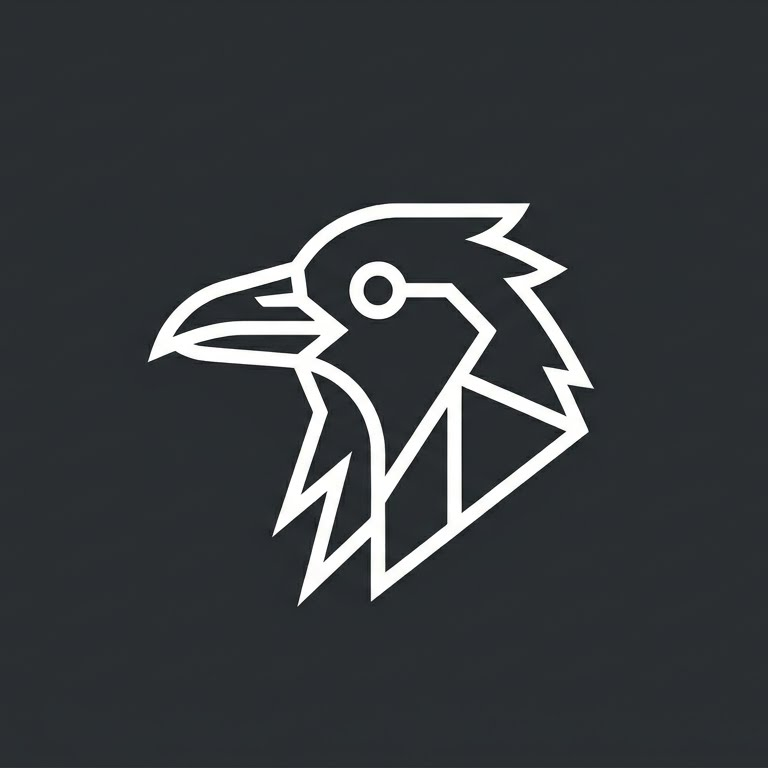

# RavenDB Doctor MCP

> *"Deep into that darkness peering, long I stood there, wondering, fearing,*
> *Doubting, dreaming dreams no mortal ever dared to dream before."*
> — Edgar Allan Poe, *The Raven*

An [MCP](https://modelcontextprotocol.io/) server that exposes RavenDB's debug and monitoring endpoints as tools for AI assistants. Connect Claude (or any MCP client) to your RavenDB cluster and ask it to investigate performance, health, indexing, replication, memory, and more — in plain language.

## Adding to Claude

### Option 1: Docker (recommended)

Build the image once:

```bash
docker build -t ravendb-doctor-mcp:latest .
```

Then add the server to your Claude MCP config. The config file location depends on the client:

- **Claude Desktop** — `claude_desktop_config.json` (open via Settings → Developer → Edit Config)
- **Claude Code** — `.mcp.json` in your project root, or `~/.claude/mcp.json` for global use

Copy `mcp-config.example.json` as a starting point and fill in your values:

**Unsecured / HTTP cluster:**

```json
{
  "mcpServers": {
    "ravendb-doctor": {
      "command": "docker",
      "args": [
        "run", "-i", "--rm",
        "-v", "C:/ravendb-mcp-output:/data/output",
        "-e", "RAVEN_NODE_URLS=http://localhost:8080",
        "ravendb-doctor-mcp:latest"
      ]
    }
  }
}
```

**Secured cluster with PFX certificate:**

```json
{
  "mcpServers": {
    "ravendb-doctor": {
      "command": "docker",
      "args": [
        "run", "-i", "--rm",
        "-v", "C:/ravendb-certs:/certs:ro",
        "-v", "C:/ravendb-mcp-output:/data/output",
        "-e", "RAVEN_NODE_URLS=https://a.your-cluster.ravendb.cloud:443,https://b.your-cluster.ravendb.cloud:443,https://c.your-cluster.ravendb.cloud:443",
        "-e", "RAVEN_CERT_PFX=/certs/admin.client.certificate.pfx",
        "-e", "RAVEN_CERT_PASSWORD",
        "ravendb-doctor-mcp:latest"
      ],
      "env": {
        "RAVEN_CERT_PASSWORD": "your-pfx-password-here"
      }
    }
  }
}
```

> Passing the password via `env` (not inline in `args`) keeps it out of process listings.

### Option 2: Node directly (no Docker)

```bash
npm install
npm run build
```

```json
{
  "mcpServers": {
    "ravendb-doctor": {
      "command": "node",
      "args": ["dist/index.js"],
      "cwd": "/path/to/ravendb-doctor-mcp",
      "env": {
        "RAVEN_NODE_URLS": "http://localhost:8080",
        "RAVEN_OUTPUT_DIR": "/tmp/ravendb-mcp-output",
        "RAVEN_LOG_LEVEL": "warn"
      }
    }
  }
}
```

## Configuration

All options can be set via environment variables or a JSON config file.

### Environment variables

| Variable | Required | Description |
|----------|----------|-------------|
| `RAVEN_NODE_URLS` | Yes | Comma-separated RavenDB node URLs |
| `RAVEN_CERT_PFX` | For secured clusters | Path to PFX client certificate |
| `RAVEN_CERT_PASSWORD` | If PFX is password-protected | PFX password |
| `RAVEN_CERT_PEM` | Alternative to PFX | Path to PEM certificate |
| `RAVEN_CERT_KEY` | With PEM | Path to private key file |
| `RAVEN_CERT_CA` | Optional | Path to CA certificate for verification |
| `RAVEN_OUTPUT_DIR` | No | Directory for large response files (default: `/data/output`) |
| `RAVEN_LOG_LEVEL` | No | `trace`/`debug`/`info`/`warn`/`error` (default: `info`) |
| `RAVEN_SPILL_THRESHOLD_BYTES` | No | Responses larger than this spill to disk (default: 262144) |
| `RAVEN_CONFIG_FILE` | No | Path to a JSON config file |

### JSON config file

Loaded automatically from `/etc/ravendb-mcp/config.json`, `./ravendb-mcp.json`, or the path in `RAVEN_CONFIG_FILE`. Environment variables override file values.

```json
{
  "nodeUrls": ["https://a.example.ravendb.cloud:443"],
  "cert": {
    "pfx": "/certs/admin.client.certificate.pfx",
    "password": "secret"
  },
  "outputDir": "/data/output",
  "logLevel": "info",
  "spillThresholdBytes": 262144
}
```

## What you can ask Claude

Once connected, Claude has access to 114 diagnostic tools grouped by area:

- **Cluster** — topology, Raft log, observer decisions, node ping, maintenance stats
- **Memory** — GC stats, allocations, heap fragmentation, low-memory log
- **CPU / threads** — thread pool, runaway threads, contention, stack traces
- **Indexes** — list, stats, errors, performance, staleness, terms, merge suggestions
- **Storage** — B-tree / FST structure, compression dictionaries, free space, environment report
- **Replication** — progress, outgoing failures, reconnect queue, incoming activity
- **ETL** — progress, stats, performance, debug info
- **Queries** — running queries, cached query plans
- **Documents** — huge documents, revisions, corrupted IDs, missing attachments
- **Collections** — stats with revision and tombstone counts
- **Transactions** — server-wide and per-database transaction info
- **Server info** — build version, database list, routes, alerts, notifications
- **Dumps / packages** — memory dump, GC dump, info packages (cluster and per-database)

Example prompts:
- *"Is the cluster healthy? Show me topology and any alerts."*
- *"Which indexes on the Orders database are stale or have errors?"*
- *"What's the memory situation? Any fragmentation or GC pressure?"*
- *"Show replication progress and flag any failures."*
- *"Grab an info package for the NorthWind database."*

## Large responses

Responses larger than `spillThresholdBytes` (default 256 KB) are written to a timestamped file in `RAVEN_OUTPUT_DIR` and Claude receives a path + preview. Mount a host directory to that path so you can open the files:

```
-v C:/ravendb-mcp-output:/data/output
```

## Development

```bash
npm install
npm run dev        # run with tsx, no build step
npm run build      # compile to dist/
npm run typecheck  # type-check without emitting
npm run lint       # ESLint
npm test           # Vitest unit tests
```
